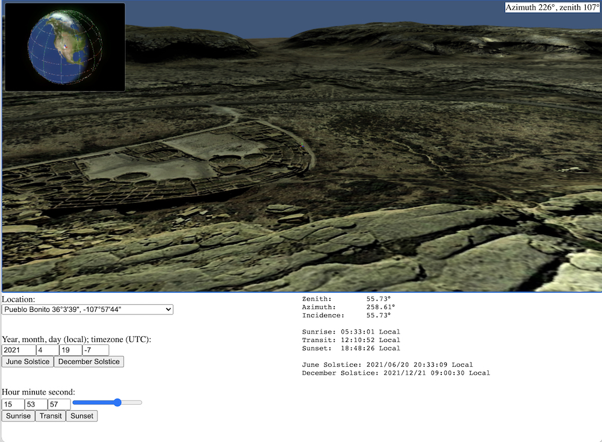
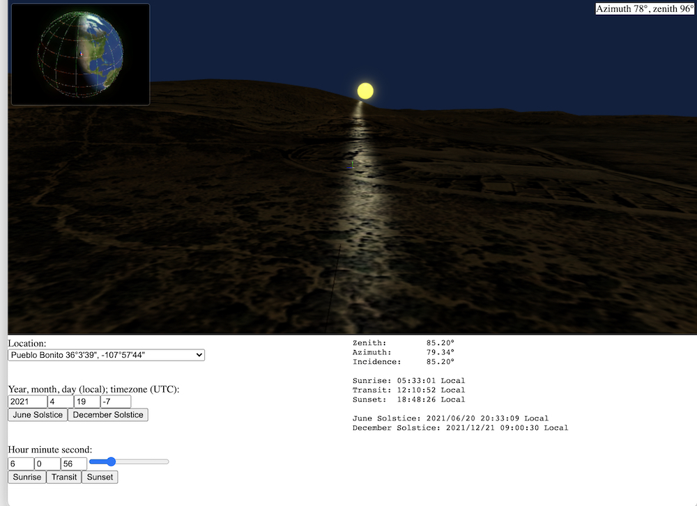
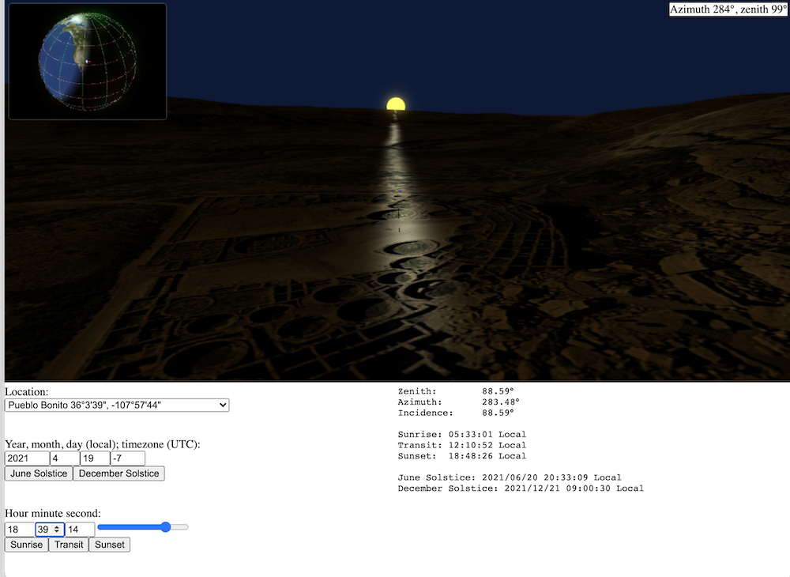

# Solar

An implementation of the [NREL's solar position algorithm](https://midcdmz.nrel.gov/spa/) (SPA) in [TypeScript](https://www.typescriptlang.org/) allied to a 3D viewing system for topographical models using [Babylon.js](https://www.babylonjs.com/). Allows the creation of web pages to explore the effects of sun position by date on geographical locations such as archaeological sites.

The SPA calculates the solar zenith and azimuth angle with uncertainties equal to ±0.0003° in the period of -2000 to 6000 CE.

## Prerequisites:

- [TypeScript](https://www.typescriptlang.org/)
- [Babylon.js](https://www.babylonjs.com/)
- Models of the local topography (from e.g. [Topography](https://github.com/JohnGrime/Topography) )

## Example

A view looking south across the [Pueblo Bonito](https://en.wikipedia.org/wiki/Pueblo_Bonito) structure at [Chaco Canyon](https://www.nps.gov/chcu/index.htm):



A view from the same location, looking east just after sunrise:



... and looking west around sunset:



Note: the model data for Chaco Canyon is *not* provided in the repository due to the size of the files.

## Modification

To use this system for your own purposes, modify the `localInfo` substructure of the `systemData` structure in `solar.ts` to provide your own 3D models and waypoints:

```
localInfo: {
	model_paths: [
		{ dir: "./local_dir_1/", file: "model1.obj" },
		{ dir: "./local_dir_2/", file: "model2.obj" },
		... etc ...
	],

	waypoints: [
		{
			name: "My waypoint location 1",
			lat: [h, m, s], // integers, as: hours mins, secs
			lon: [h, m, s], // integers, as: hours mins, secs
		},
		... etc ...
	],
}
```

## Credits

SPA algorithm : `Reda, I.; Andreas, A., Solar Position Algorithm for Solar Radiation Applications, Solar Energy. Vol. 76(5), 2004; pp. 577-589`.

Globe map : [Solar System Scope](https://www.solarsystemscope.com/textures/)
